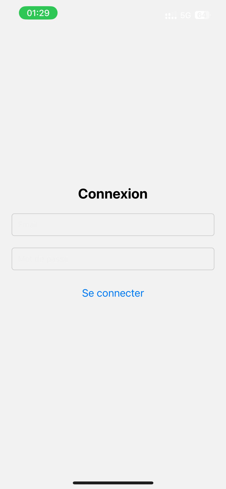
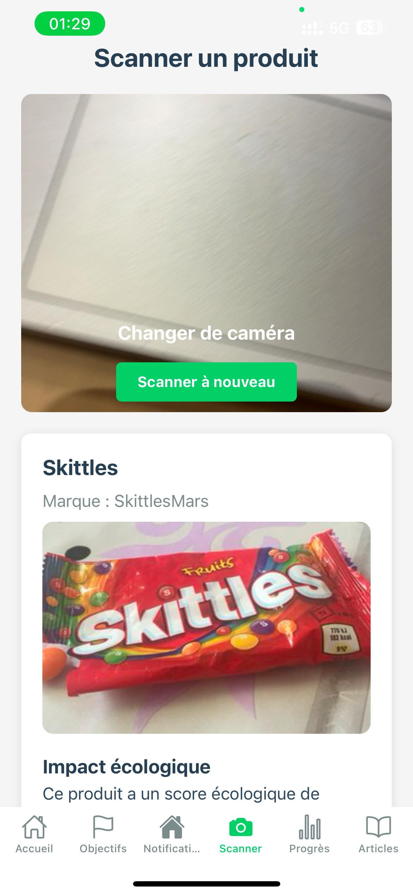
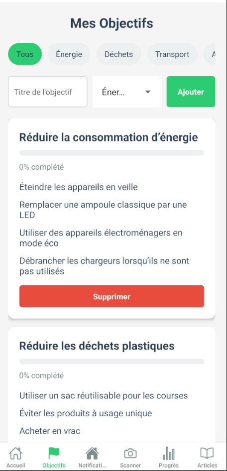

# GreenHabit 🌱

**GreenHabit** est une application mobile conçue pour aider les utilisateurs à adopter de nouvelles habitudes plus respectueuses de l'environnement. Développée lors d'un hackathon de 36 heures, cette application propose des fonctionnalités innovantes pour sensibiliser et encourager les utilisateurs à réduire leur impact écologique au quotidien.

---

## Fonctionnalités principales 🚀

GreenHabit propose plusieurs fonctionnalités clés pour accompagner les utilisateurs dans leur transition écologique :

1. **Suivi des objectifs personnalisés** :
   - Définissez des objectifs écologiques (ex : réduire la consommation d'eau, diminuer les déchets plastiques).
   - Suivez votre progression grâce à des mini-tâches et des indicateurs visuels.

2. **Notifications et rappels quotidiens** :
   - Recevez des notifications pour rester motivé et engagé dans vos objectifs.
   - Des messages personnalisés en fonction de vos progrès.

3. **Scanner de produits** :
   - Scannez les codes-barres des produits pour obtenir des informations sur leur impact écologique.
   - Recevez des conseils et des alternatives plus respectueuses de l'environnement.

4. **Articles et tutoriels** :
   - Accédez à des articles éducatifs pour apprendre de nouvelles pratiques écologiques.
   - Des suggestions de contenu en fonction de vos objectifs.

5. **Comparaison des progrès** :
   - Comparez vos progrès avec d'autres utilisateurs ayant des objectifs similaires.
   - Participez à des défis communautaires pour rester motivé.

---

## Architecture & Technologies 🛠️

### Principaux packages utilisés

- **Frontend** :
  - **React Native** : Framework pour le développement d'applications mobiles multiplateformes.
  - **Expo** : Outil pour simplifier le développement et le déploiement d'applications React Native.
  - **React Navigation** : Gestion de la navigation entre les écrans de l'application.
  - **Axios** : Client HTTP pour les requêtes API.

- **Backend** :
  - **Open Food Facts API** : API utilisée pour récupérer les informations sur les produits scannés.

- **Autres dépendances** :
  - **Expo Camera** : Pour la fonctionnalité de scan des codes-barres.
  - **React Native Vector Icons** : Pour les icônes dans l'interface utilisateur.
  - **AsyncStorage** : Pour le stockage local des données utilisateur.

### Dépendances principales

Voici une liste des dépendances principales avec leurs versions :

```json
"dependencies": {
  "@expo/vector-icons": "^14.0.4",
  "@react-native-async-storage/async-storage": "^2.1.0",
  "@react-navigation/bottom-tabs": "^7.2.0",
  "@react-navigation/native": "^7.0.14",
  "@react-navigation/stack": "^7.1.1",
  "axios": "^1.7.9",
  "expo": "~52.0.26",
  "expo-camera": "^16.0.13",
  "expo-constants": "~17.0.4",
  "expo-font": "~13.0.3",
  "expo-linking": "~7.0.4",
  "expo-router": "~4.0.17",
  "expo-splash-screen": "~0.29.21",
  "expo-status-bar": "~2.0.1",
  "react": "18.3.1",
  "react-dom": "18.3.1",
  "react-native": "0.76.6",
  "react-native-gesture-handler": "~2.20.2",
  "react-native-reanimated": "~3.16.1",
  "react-native-safe-area-context": "^4.12.0",
  "react-native-screens": "~4.4.0",
  "react-native-vector-icons": "^10.2.0",
  "react-native-web": "~0.19.13"
}
```

# Installation 🛠️

Suivez ces étapes pour installer et exécuter le projet sur votre machine locale.

## Prérequis
- **Node.js** (version 16 ou supérieure)
- **Expo CLI** (installé globalement)
- **Git** (pour cloner le dépôt)

## Étapes d'installation

### Cloner le dépôt :

```bash
git clone git@github.com:Atseiro/EcoSentinel.git
cd EcoSentinel
```

### Installer les dépendances :

```bash
npm install
```

### Démarrer l'application :

```bash
npm run start
```

### Exécuter sur un appareil ou un émulateur :
- Utilisez l'application **Expo Go** sur votre smartphone pour scanner le QR code affiché dans le terminal.
- Ou utilisez un émulateur Android/iOS pour tester l'application.
- Connectez-vous avec:
  - mail: 'alice.dupont@example.com'
  - password: securepassword123
---

## Documentation technique

Pour une version téléchargeable de la documentation technique, consultez le [résumé technique](./assets/Documentation%20Technique.pdf).
La Version complète se trouve dans le dossier docs/

## Liens Utiles 🔗
- **Dépôt GitHub du projet** : [GreenHabit GitHub Repository](https://github.com/Atseiro/EcoSentinel)
- **Documentation Open Food Facts** : [Open Food Facts API Documentation](https://world.openfoodfacts.org/data)

---

## Captures d'écran 📸
Voici quelques captures d'écran de l'application :

- **Page de connexion**  
  

- **Scanner un produit**  
  

- **Suivi des objectifs**  
  

---

## Contribuer 🤝

Nous accueillons les contributions à ce projet ! Si vous souhaitez contribuer, veuillez suivre ces étapes :

1. **Forkez** le dépôt.
2. Créez une nouvelle branche :
   ```bash
   git checkout -b feature/AmazingFeature
   ```
3. Committez vos changements :
   ```bash
   git commit -m 'Add some AmazingFeature'
   ```
4. Poussez vers la branche :
   ```bash
   git push origin feature/AmazingFeature
   ```
5. Ouvrez une **Pull Request**.

---

## Licence 📜

Ce projet est sous licence **MIT**. Pour plus de détails, consultez le fichier [LICENSE](LICENSE).

---

## Remerciements 🙏

Un grand merci à tous les contributeurs et à l'équipe du hackathon pour leur soutien et leurs idées innovantes !

---

**GreenHabit** - Faites un pas vers un mode de vie plus écologique ! 🌍
# baraka_technologies
